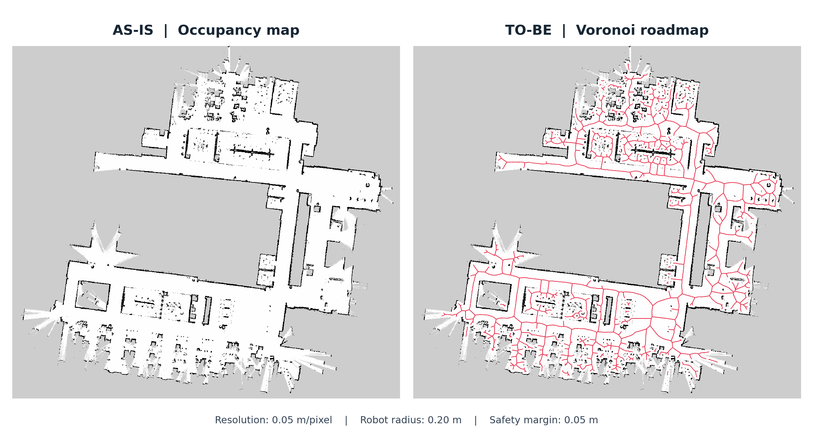

# ROS 2 PGM → Voronoi Roadmap

Generate Voronoi centerlines in the white free space of an occupancy map and
export an undirected graph for A* or Dijkstra planning. Roadmap generation runs
without ROS; a separate script publishes the result for ROS 2 RViz.

## Quick start

Run these commands from the repository directory:

```bash
python3 -m pip install -r requirements.txt
python3 pgm_voronoi.py map/map.pgm
```

The default output directory is `output/`. Filenames follow the input image stem:

| Output | Description |
| --- | --- |
| `map_voronoi_overlay.png` | Original map with the Voronoi roadmap drawn in red |
| `map_voronoi_skeleton.png` | Black-and-white visualization at the original map size |
| `map_voronoi_graph.json` | Nodes, edges, lengths, and obstacle clearance for planning |

The source map is left unchanged.

## Map metadata and distance units

**A PGM file is sufficient to generate the roadmap.** Without a resolution,
all distance options and exported graph distances use **pixels**.

A matching `.yaml` or `.yml` file is loaded automatically when it has the same
stem as the PGM. You can also pass the YAML file directly. The command accepts
**one input file**: pass either the PGM or the YAML, not both as positional arguments.
The YAML `image` field must point to the corresponding image.

With a resolution supplied through YAML or `--resolution`, distances use
**meters**. YAML also provides `origin`, `negate`, and occupancy thresholds.

```bash
# Example for a map whose actual resolution is 0.05 m/pixel.
python3 pgm_voronoi.py map/map.pgm --resolution 0.05 \
  --robot-radius 0.22 --safety-margin 0.05 --min-branch-length 0.3

# Load the image and metadata from a ROS map YAML.
python3 pgm_voronoi.py /path/to/map.yaml --robot-radius 0.22 --safety-margin 0.05

# Remove short terminal branches using pixel units when no YAML is present.
python3 pgm_voronoi.py map/map1.pgm --min-branch-length 8 --output-dir output/pruned

python3 pgm_voronoi.py --help
```

Use `--origin X Y YAW` to specify translation in meters and rotation in radians.
If only the resolution is supplied, the default origin is `[0, 0, 0]`.
To align with an existing ROS map, use that map's actual resolution and origin.

Both `--robot-radius` and `--safety-margin` default to zero. For example, a radius
of `0.2` m and margin of `0.05` m require a clearance lower bound greater than
`0.25` m. If any part of an edge fails this check, **the entire edge is removed**;
the script does not trim only the offending portion.

## Display in ROS 2 RViz

`voronoi_rviz.py` converts the **JSON graph into a
`visualization_msgs/msg/Marker` with type `LINE_LIST`** and publishes red lines on
`/voronoi`. The PNG files are for image viewing.

Run the following from the repository directory:

```bash
source /opt/ros/humble/setup.bash

# For a graph generated without metadata, supply the actual map resolution
# and origin. The values below are examples; replace them to match your map.
python3 voronoi_rviz.py output/map_voronoi_graph.json \
  --resolution 0.05 --origin -12.9 -11.2 0

# If the JSON already contains the correct resolution and origin:
python3 voronoi_rviz.py /path/to/metric_voronoi_graph.json
```

Configure RViz as follows:

1. Set **Global Options → Fixed Frame** to `map`.
2. Add a **Marker** display and set its **Topic** to `/voronoi`.
3. To show the background map, add a **Map** display with **Topic** set to `/map`.

Keep the publisher running. It republishes once per second using Reliable /
Transient Local QoS. Use `--line-width 0.03` to set line width in meters and
`--frame-id map` to set the coordinate frame. The default `--z 0.03` places
the lines 3 cm above the map to avoid overlapping surfaces.

The YAML file itself is optional, but the **resolution, origin, and coordinate
frame must match the displayed map** for correct alignment. Pixel-based JSON
without an explicit resolution is rejected to prevent pixels from being
interpreted as meters. Display overrides do not modify the JSON or reapply the
radius and margin filters used during roadmap generation.

This script publishes the Voronoi lines only. Use an existing map server's
`/map` topic for the background. No TF transform is needed to display the lines
when both the RViz Fixed Frame and Marker frame are `map`. A different Fixed
Frame requires a TF transform between the frames.

Reference: [ROS 2 RViz Marker documentation](https://docs.ros.org/en/humble/Tutorials/Intermediate/RViz/Marker-Display-types/Marker-Display-types.html).

## How it works

- With the defaults `negate=0` and `free_thresh=0.196`, a pixel is free when
  `(255 - gray) / 255 < free_thresh`. In the example maps, 254 is free;
  0 and 205 are blocked. Space outside the image is also blocked.
- Centers of blocked cells bordering free space become sites for SciPy Voronoi.
  Ridges between sites less than 2 pixels apart are discarded to reduce branches
  between neighboring samples of the same wall. This produces an **approximate
  medial axis** from a sampled grid.
- To reduce branches caused by the staircase shape of slanted walls, the script
  measures the angle between the two sites at the midpoint of a terminal branch's
  attachment segment. If the angle is below `--min-site-angle` (45° by default),
  the whole terminal branch is removed. This filter preserves closed loops.
  Set `--min-site-angle 0` to disable it.
- A lower bound on obstacle clearance is calculated over each entire segment.
  The calculation encloses blocked cells in their circumscribed circles, so it
  is conservative and may underestimate the true distance to cell boundaries.
  Only segments with clearance greater than `robot-radius + safety-margin`
  remain. Use the circular footprint radius, or the circumscribed radius of a
  noncircular robot.
- `--min-branch-length` repeatedly removes short terminal branches. Its default
  value of zero disables length-based pruning. Branch, angle, and radius filters
  can remove access to narrow passages or some destinations.
- The script supports 8-bit grayscale PGM images and trinary/scale map YAML.
  Intermediate occupancy values in scale mode are also blocked unless they meet
  the free-space criterion. Raw mode is not supported.

## Use the graph in a planner

The JSON stores **nodes and their edge connections**, rather than just a rendered
drawing. Each edge represents a straight segment between two nodes. Bends in a
route are represented by multiple edges, and intermediate vertices are retained.

The `map.units` field is either `m` or `px`.

| Field | Meaning |
| --- | --- |
| `nodes[].id` | Node ID; also its index in the nodes array |
| `nodes[].pixel` | Image coordinates `[u, v]`; integer coordinates are pixel centers |
| `nodes[].position` | Transformed coordinates `[x, y]`, using the formula below |
| `nodes[].component` | Connected component ID; different components have no connecting path |
| `edges[].source`, `target` | Endpoints of an undirected edge |
| `edges[].length` | Segment length, suitable as an A*/Dijkstra edge cost |
| `edges[].min_clearance` | Lower bound on obstacle clearance over the whole edge; robot radius has not been subtracted |

Coordinate conversion:

```text
local = [(u + 0.5), (height - v - 0.5)] * resolution
position = origin.xy + R(origin.yaw) * local
```

A scale of 1 is used when no resolution is available. This conversion flips the
image's downward-pointing vertical axis to an upward-pointing map axis.

Build an adjacency list with both directions of each edge and use `length` as
the traversal cost. Start and goal positions that are not on the graph must be
attached using **collision-checked connecting segments**. Connecting directly
to the nearest node without checking the segment can cross a wall.

The skeleton PNG is a visualization. Pixel rounding can make its apparent
connectivity differ from the JSON graph.

The current output is a static roadmap. A Nav2 planner plugin, start/goal
attachment, dynamic costmap checks, and final footprint checks are not included.

## Validation

```bash
python3 -m unittest -v
```

Tests cover coordinate conversion, corridor connectivity, radius filtering,
diagonal contacts, loops around obstacles, branch pruning, and clearance against
actual blocked cells, as well as RViz coordinate conversion.

References:
[SciPy Voronoi](https://docs.scipy.org/doc/scipy/reference/generated/scipy.spatial.Voronoi.html) and
[Nav2 Humble map loading implementation](https://api.nav2.org/nav2-humble/html/map__io_8cpp_source.html).

## As-is / To-be

The comparison below uses `map/airbot_map_00.pgm` and the saved
`output/airbot_map_00_voronoi_graph.json`.

- **As-is:** the original occupancy map, with white free space, black obstacles,
  and gray unknown regions.
- **To-be:** the same map with the retained Voronoi edges drawn in red.

This result uses **0.05 m/pixel**, a **0.20 m robot radius**, and a
**0.05 m safety margin**, with the default 45° branch-angle filter and no
length-based branch pruning. Edges must have a clearance lower bound greater
than 0.25 m.

Reproduce the roadmap with:

```bash
python3 pgm_voronoi.py map/airbot_map_00.pgm \
  --resolution 0.05 --origin -28.4 -39.1 0 \
  --robot-radius 0.2 --safety-margin 0.05
```


